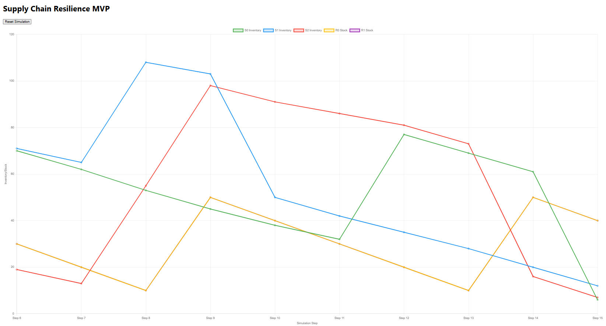

# Supply Chain Resilience MVP 
A multi-agent AI system to enhance supply chain resilience for small businesses using Python (Mesa) and JavaScript (React).

## Overview 
This project simulates a supply chain with Supplier and Retailer agents. Agents detect disruptions (e.g., low inventory) and communicate to mitigate issues (e.g., place orders). A React dashboard visualizes inventory levels and agent messages.

## Setup 
### Backend 
python -m venv venv
source venv/bin/activate
On Windows: venv\Scripts\activate
pip install -r requirements.txt
python server.py

### Frontend 
cd frontend
npm install
npm start

## Usage 
Access the dashboard at http://localhost:3000.
Trigger simulation steps via http://localhost:5000/api/step.
Reset the simulation via http://localhost:5000/api/reset.

## Future Work
Add Manufacturer and Logistics agents.

## License
MIT